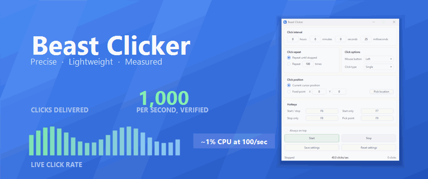
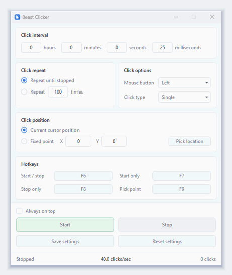
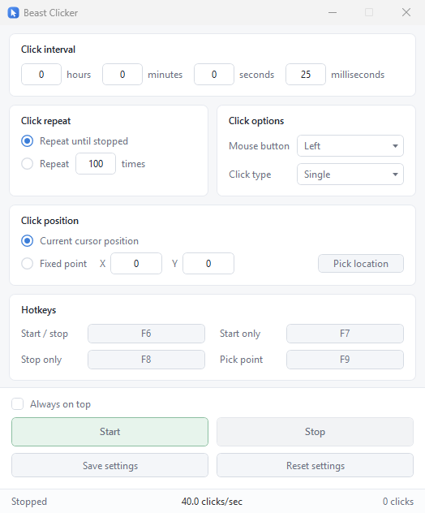

<div align="center">



### A precise, low-overhead auto clicker for Windows

[](https://github.com/beastops/beastclicker/releases/latest)
[](https://github.com/beastops/beastclicker/releases)
[](https://github.com/beastops/beastclicker/actions)
[](LICENSE)


</div>

A free, open source auto clicker for Windows 10 and 11. Set an interval, pick a mouse
button, press a hotkey. No installer, no adware, nothing to sign up for.

## Why another one

Two things bothered me about the auto clickers I tried.

The interval box often lies. Set a popular one to 1 ms and you do not get 1000 clicks a
second, you get about 57, because a plain `Sleep(1)` gets rounded up to Windows' 15.6 ms
timer tick. I measured that with a mouse hook rather than believing the setting.

Then there's CPU. Clickers that do hit high rates usually get there by spinning in a
loop, which eats a core and makes games stutter. This one parks the thread on a Windows
high resolution timer instead, so 100 clicks a second costs about 1% of one core.

<div align="center">



<sub>Unedited capture. <kbd>F6</kbd> starts it, the counter updates live, <kbd>F7</kbd> stops it.</sub>

</div>

## What it does



Intervals from 1 ms upward, entered as hours, minutes, seconds and milliseconds. Left,
right or middle button. Single or double click. Run until you stop it, or stop after a
set number of clicks.

It clicks wherever the cursor is, or at a fixed point you capture with a hotkey. All four
hotkeys are global and rebindable, so start and stop keep working while a game holds
focus. If Windows refuses a hotkey because another program already owns it, the app tells
you instead of failing quietly.

Settings persist to `%APPDATA%\BeastClicker\config.json`. There is an always on top
toggle, and fixed points land on real pixels because the app is per monitor DPI aware.

<br clear="right">

## Install

Both builds are a single file, and neither writes anything outside
`%APPDATA%\BeastClicker`. Get them from [Releases](../../releases/latest).

`BeastClicker-Standalone.exe` has the .NET runtime inside it. Nothing to install, works
on a clean Windows box. That is why it is around 59 MB.

`BeastClicker.exe` is about 280 KB but needs the
[.NET 10 Desktop Runtime](https://dotnet.microsoft.com/download/dotnet/10.0) (x64). Worth
it if you already have the runtime or do not mind installing it.

<details>
<summary><b>MSIX package</b> (Start menu install, but read this first)</summary>

`BeastClicker.msix` is published too, signed with a self signed certificate. Windows
refuses to install it until that certificate is trusted:

1. Download `BeastClicker.msix` and `BeastClicker.cer`.
2. Right click the `.cer`, choose Install Certificate, pick Local Machine, then
   "Place all certificates in the following store" and choose Trusted People.
3. Open the `.msix`.

Step 2 means extending trust to a certificate, which is a real security decision. Only do
it if you understand what you are agreeing to. The plain `.exe` needs none of this and is
the better choice unless you specifically want a Start menu entry.

Making the MSIX install cleanly needs a certificate from a real certificate authority, or
Microsoft Store signing. This project has neither.

</details>

### First run

SmartScreen may warn you, because the executable is not code signed. More info, then Run
anyway. Removing that warning needs a paid code signing certificate.

### Verifying a download

Every release ships `SHA256SUMS.txt`, and each binary carries a GitHub build
attestation. The attestation is the stronger of the two: it ties the file in your
downloads folder to the exact commit and workflow run that built it, which is something
you can check rather than take my word for.

```bash
gh attestation verify BeastClicker.exe --repo beastops/beastclicker
```

Antivirus false positives do happen to auto clickers. Synthesising mouse input looks the
same to a heuristic whether the program doing it is a clicker or a keylogger, and a
compressed single file build looks like a self extracting archive because that is exactly
what it is. If a scanner flags a release binary, the attestation shows where it came
from, and it is worth reporting to the vendor as a false positive.

## How it works

Every click is one `SendInput` call carrying both the press and the release. Windows
injects everything in a single call atomically, so no mouse movement can slip between the
two. That is why moving the mouse while it clicks can never turn into a drag. If anything
throws between press and release, a failsafe release runs, so a button is never left held
down.

Deadlines sit on an absolute grid instead of being measured from the previous click:

```
deadline(n) = start + n*T + jitter(n)
```

`jitter` is a zero mean stationary AR(1) process, so consecutive gaps vary and correlate
the way human motor timing does. Its mean being zero keeps the expected deadline at
exactly `start + n*T`, which buys two things: variance costs nothing in throughput, and
errors cancel instead of accumulating into drift.

For the waiting itself, `CreateWaitableTimerEx` with `CREATE_WAITABLE_TIMER_HIGH_RESOLUTION`
parks the thread until just before the deadline, and only the last fraction of a
millisecond gets spun. The engine thread runs at `AboveNormal` rather than `Highest`, on
purpose, so it never outranks the threads of whatever you are actually using.

On two cores or fewer that spin is dropped altogether. It is worth a sliver of a core
when there are cores to spare, and not worth it when the thread it competes with belongs
to the program being clicked, so those machines take the timer's own half millisecond of
slop instead.

Worth recording: `timeBeginPeriod(1)` is called but not trusted. In testing it returned
success while the calling thread still got 15.6 ms granularity, so the schedule works
whether or not it takes effect.

## Numbers

Sustained runs, 60 seconds per interval, sampled every 15 seconds. The delivered column
counts events with a `WH_MOUSE_LL` hook, so those are clicks Windows actually dispatched,
not clicks the app meant to send.

| Interval | Target /sec | Delivered | Drift | CPU (1 core) | RAM |
|---------:|------------:|----------:|------:|-------------:|----:|
| 1 ms | 1,000 | 1,000.0 | 0.00% | 23 to 25% | 24.7 MB |
| 5 ms | 200 | 200.0 | 0.02% | about 3% | 24.7 MB |
| 10 ms | 100 | 100.0 | 0.01% | 1.1 to 2.2% | 24.7 MB |
| 25 ms | 40 | 40.0 | 0.11% | about 1% | 24.7 MB |
| 50 ms | 20 | 20.0 | 0.07% | 0.4 to 0.9% | 24.7 MB |
| 100 ms | 10 | 10.0 | 0.05% | 0.2 to 0.4% | 24.6 MB |

That sweep delivered 82,555 clicks, every press matched by a release, no stuck button.
CPU and memory stayed flat from the 15 second mark to the 60 second mark at every
interval, so nothing degrades the longer it runs.

On very high rates: 1 ms works and holds 1000 a second, but almost nothing on the
receiving end processes a thousand input events a second smoothly. Past a few hundred the
limit is the target program's input queue, not this one. 10 ms is the setting I would
actually use, and the clicks per second readout turns amber above 200 for that reason.

## Checking it yourself

Every number above came from `tools/BeastClicker.Benchmarks`, which drives the real
engine rather than a copy of it. Start the app, then:

```bash
cd tools/BeastClicker.Benchmarks
dotnet run -c Release                  # scheduling accuracy across intervals
dotnet run -c Release -- cpu           # CPU cost per interval
dotnet run -c Release -- emit          # press/release pairing, the anti drag check
dotnet run -c Release -- realrate 10   # delivered rate at 10 ms, hook counted
dotnet run -c Release -- stress 10 180 # long run with periodic sampling
dotnet run -c Release -- watch         # count another clicker's output, for comparison
```

Clicks are aimed at the Beast Clicker window's own background, so nothing else gets
touched. `watch` is how I measured the 57 clicks a second figure at the top.

## Build

```bash
git clone https://github.com/beastops/beastclicker.git
cd beastclicker
dotnet build -c Release
```

Standalone executable with the runtime inside it:

```bash
dotnet publish src/BeastClicker -c Release -r win-x64 --self-contained true \
  -p:PublishSingleFile=true -p:EnableCompressionInSingleFile=true \
  -p:IncludeNativeLibrariesForSelfExtract=true -o dist-standalone
```

`tools/BeastClicker.Tools` regenerates the repository's own assets. Each command
overwrites the file it names, so run only the one you mean:

```bash
dotnet run --project tools/BeastClicker.Tools -- icon
```

`icon` rebuilds the app icon, `social` the link preview card, `banner` the animated
README hero, `demo` re-records the demo GIF from the running app, and `msix` builds
and signs the package. `demo` drives the app through its global hotkeys and takes a
few minutes to encode.

## Before you use it

This is a general purpose input automation tool. Plenty of games and online services ban
automated input in their terms, and some actively look for it.

Beast Clicker does not try to hide from anti cheat or detection systems, and none of its
design is aimed at that. The timing variance exists because perfectly even machine timing
is a poor model of a human hand, not to fool anything. Whether automation is allowed
where you want to use it is yours to check.

## License

[MIT](LICENSE)
